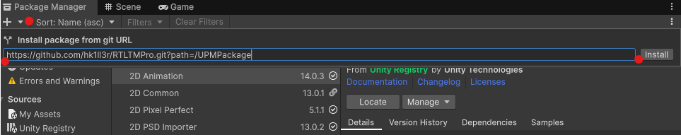
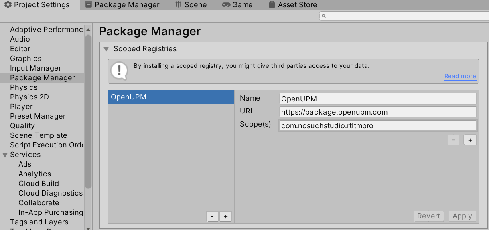
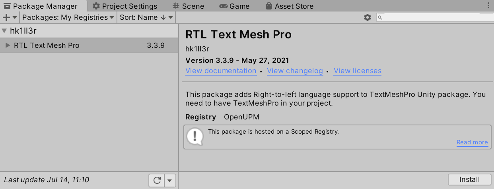
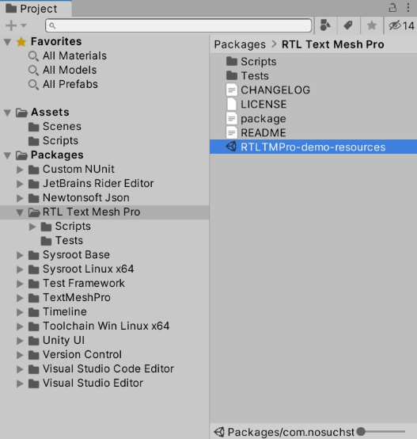

# RTL Text Mesh Pro
This is the packaged version of RTL TextMeshPro Unity plugin.

[main github repo](https://github.com/pnarimani/RTLTMPro)

# Installation
### from Git URL [Recommended 👍]

0. Open Unity Package Manager (UPM) in Unity Editor.
1. Press the add button `+`.
2. Enter this repo's URL: https://github.com/hk1ll3r/RTLTMPro.git?path=/UPMPackage
3. Press `Install`.

### from OpenUPM
[hk1ll3r](https://github.com/hk1ll3r/) maintains a package manager version of this repo on [OpenUPM](https://openupm.com/packages/com.nosuchstudio.rtltmpro/).

In Project Settings window, add OpenUPM as a scoped registry or if you have already added it, add the new scope to it.

Then in Package Manager window, change scope to *My Registries*. Select "RTL Text Mesh Pro" package and press *Install*.

# Demo Resources
The sample scenes and demo resources (fonts, shaders, etc.) are included in the package as a .unitypackage file. You need to import those into your Assets folder to use them. From the project window navigate to the package folder and double click "RTLTMPRo-demo-resources" file to import these assets into your project.

